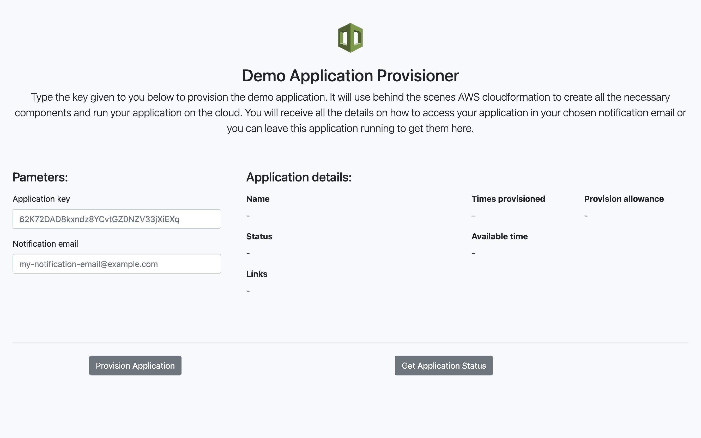
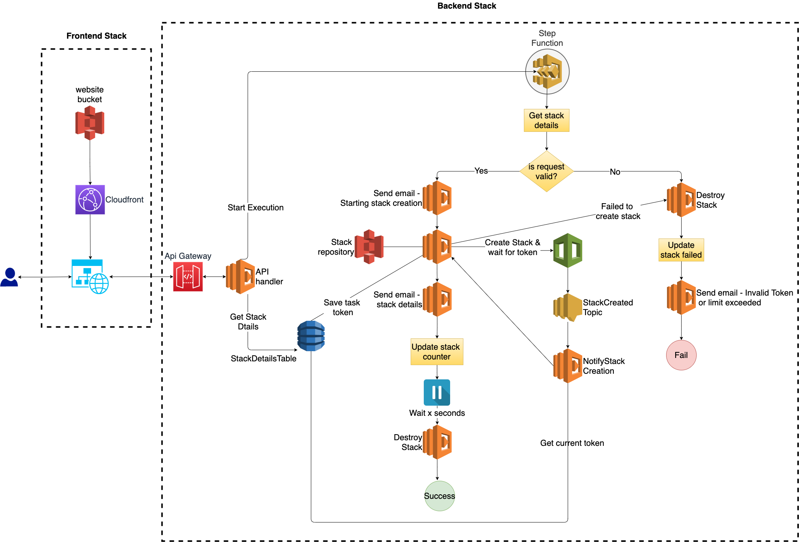

# Welcome to the Stack Provisioner Application
 
This little application provisions other applications on AWS that can be used for demo purposes by giving final users a simple token. The demo application is created and available for X amount of time before it is automatically destroyed to save on costs. You can also configure how many times someone can re-provision the same application as multiple third parties might want to take a look at it at different times.
 
This is useful if you need to demo an application to a third-party and want to make it super simple for them to provision the app when they need it so you don't overpay for having to pre-provision in advance.
 

 
 
## Motivation for this app
 
As a senior engineer, oftentimes I have to review test submissions from candidates to open roles in our company. Our tests usually consist of giving a problem to the developer and asking them to deliver their best.
 
Most of the submissions are web applications with a `README` file with all the steps necessary (hopefully 😬) to run it and some of them come with a Docker and Docker compose files to make things simpler for the reviewer but I'm a bit skeptical about running radom programs on my laptop for obvious security reasons.
 
With these things in mind I wanted something that was cheap for the developer to maintain, simple for the reviewer to run but also safe given the demo application runs on the cloud and not in their laptop.
 
<em>Ok... I will be honest, I mostly needed a pet project to do on my short paternity leave since I couldn't sleep much</em> 😅
 
## Alternatives
 
### Pre provision the demo application
 
If you are a candidate submitting multiple applications you never know when the reviewer would actually look at your app so you would incur a huge cost to keep them running for a long time unnecessarily.
 
### Cloud Formation
 
We could simply give the reviewer a cloud formation template and ask them to run in their own account but this assumes they would be willing to run random templates on their AWS account (I wouldn't) or they might not know how to do it at all.
 
### AWS service catalog
 
AWS service catalog is a great service but you would need to give access to specific people that you might not know in advance and would require them to know how to use it. You can't also configure for how long you want the stack to be up before it is destroyed nor configure how many times they can do it.
 
## Stack Provisioner Architecture
 
One of the requirements I had in mind for this project was to have it available 24 X 7 but just pay for what I used and thus a serverless architecture using lambdas, dynamoDB and other serverless components such as SNS was a good starting point. I also wanted everything to be async so no lambdas would run for more than they needed to.
 
Running a few lambdas async together requires some sort of orchestration and therefore AWS step functions was a great choice to tie all together. Although the architecture diagram might seem complicated at first it is actually using just 4 lambdas being re-used with different inputs (the send email lambda for example is used in different steps of the workflow to send different emails).
 

 
 
## Installing the Stack Provisioner in your AWS account
 
### Pre requisites
 
- The Stack Provisioner requires a SMTP server that can be used to send emails so you first must get these details with your email provider (you can use gmail or yahoo SMTP servers for example).
 
- These days most browsers will complain if you have a web form with no HTTPS configured and for this reason I believe HTTPS is a must in any web app so you need to have a public domain already configured in route53 and the Stack provisioner CDK will create the appropriated subdomains and the associated certificates.
 
- All the steps below expects that you have both CDK and the aws cli pre-installed and that you have the right set of permissions to provision all the necessary resources.
 
### Installation Steps
 
1. Save the SMTP server password in the SSM Parameter store (if you change the parameter name below you will need to also change in the backend stack)
 
```
aws ssm put-parameter --name /stackProvisioner/smtpPasswordSecret --type SecureString --value <SMTP server password>
```
 
2. Provision the backend for the Stack Provisioner app
 
```
cdk deploy StackProvisionerBackendStack \
--parameters SMTPServer=<the SMTP server used for sending emails> \
--parameters SMTPPort=<the SMTP port, defaults to 587> \
--parameters SmtpUser=<your SMTP user> \
--parameters EmailPasswordSecretName=<defaults to /stackProvisioner/smtpPasswordSecret>
--parameters FromEmail=<from email for stack notifications>
--parameters BccEmail=<an email to where send a copy of the notifications> \
--parameters Domain=<your route 53 public domain> \
--parameters Subdomain=<the subdomain to be used for this app> \
--parameters PublicHostedZoneId=<the public zone id of your domain> \
--parameters MaxWorkflowDurationDays=<This needs to be bigger than the max amount you will allow a demo app to run> \
--parameters StackBucketName=<the bucket name where you will store the cfn templates>
```
 
3. Provision the frontend for the Stack Provisioner app
 
```
cdk deploy StackProvisionerFrontendStack \
--parameters Domain=<your route 53 public domain> \
--parameters Subdomain=<the subdomain to be used for this app> \
--parameters PublicHostedZoneId=<the public zone id of your domain>>
```
 
4. Verify
 
Wait cdk to finish provisioning and confirm that you can access from your browser using the following URL:
 
```
https://<subdomain>.<domain>
```
 
## Configuring a demo application in the Stack Provisioner
 
1. Find the id for the Stack Provisioner API and take note of it
 
```
aws apigateway get-rest-apis
```
 
2. Create an api key to be used by a third party (one api key per stack must be created)
 
Example:
 
```
aws apigateway create-api-key --name 'Company ABC Key' --description 'Key for company ABC run my app on the cloud' --enabled --stage-keys restApiId='<id from step 1>',stageName='prod'
```
 
3. Take note of the returned key id and value from previous step
 
4. Find the StackUsagePlan id
 
```
aws apigateway get-usage-plans
```
 
5. Associate the api key with the StackUsagePlan id
 
```
aws apigateway create-usage-plan-key --usage-plan-id <usage plan id> --key-id <key id> --key-type "API_KEY"
```
 
6. Upload the cloudformation template that you want to use to provision your demo application to the s3 bucket you chose in the parameter `StackBucketName` for the `StackProvisionerBackendStack` and take note of the url:
 
Example:
 
```
https://<StackBucketName>.s3.<region>amazonaws.com/demo-stack.yml
```
 
7. Configure the Stack provisioner app to use it:
 
```
aws dynamodb put-item \
   --table-name StackDetailsTable \
   --item '{
       "id": {"S": "xxxxx"}, // This must be an api key value you created in step 2
       "stackName": {"S": "Demo app"}  //must be a unique name,
       "stackLocation": {"S": "https://<StackBucketName>.s3.<region>amazonaws.com/demo-stack.yml"} // URL from step 6,
       "maxCreationTimes": {"N": "3"} // how many times this stack can provisioned,
       "destroyInSeconds": {"N": "120"} //How many seconds it is up before it is automatically destroyed,
       "numTimesProvisioned": {"N": "0"} //start with 0,
       "stackStatus": {"S": ""}, //leave it blank
       "parameters": {"M": {
           "<parameter name>": {"S": "parameter value"} //Only simple string parameters are supported
       }
   }
}'
```
 
And that is it! Just give the API key to whoever you want to have access to provision this stack and the URL you chose for the frontend app and wait for compliments (hopefully)
 
## Future Improvements
  Due to the time constraints I had for this pet project there were a few things that I left out but should be improved eventually:
 
 - The source code for lambdas is just a first interaction and could be further refactored to do one thing only.
 
 - Tests, whether you like them or not they are must for every real productions system.
 
 - The frontend for this app is quite simple thus I wanted to avoid using any framework or build tool and over complicate things but at the same time I also wanted to not have to hardcode the api url in case I wanted to have different environments later on so the solution to get the dynamic api from the other stack during provisioning although working fine might not be the cleanest and would need some TLC.
 
 - Having to execute 7 steps to add a demo application seems to be a bit of a pain point so ideally this could be extended with an admin page where we can just upload a cfn template and fill out the details and the backend would automatically be configured for us.

 - Better validation and error handling.

